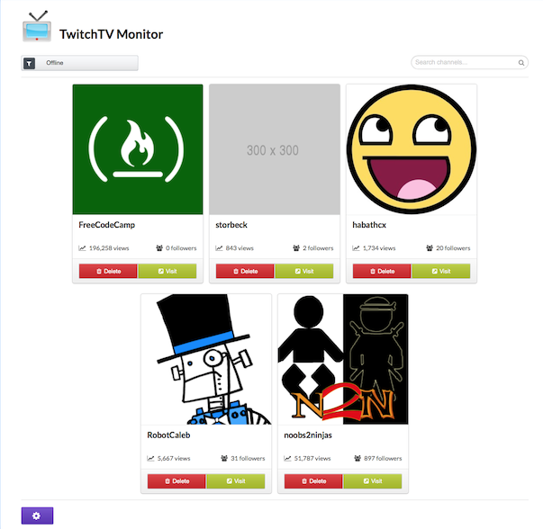

# TwitchTV

Twitch is a live streaming video platform owned by Twitch Interactive, a subsidiary of Amazon.com, Introduced in June 2011 as a spin-off of the general-interest streaming platform, Justin.tv, the site primarily focuses on video game live streaming, including broadcasts of eSports competitions, in addition to creative content, "real life" streams, and more recently, music broadcasts. Content on the site can either be viewed live or via video on demand.

## Application

The application uses the TwitchTV api to monitor the status of selected channels:

- List of channels the are currently on line
- List of channels the are off line 
- List of channels the have been deleted
- Search and add new channels

## Free Code Camp

This project is part of the course work for the [Front End Development Program](https://www.freecodecamp.org/challenges/claim-your-front-end-development-certificate).

## Screen Captures

